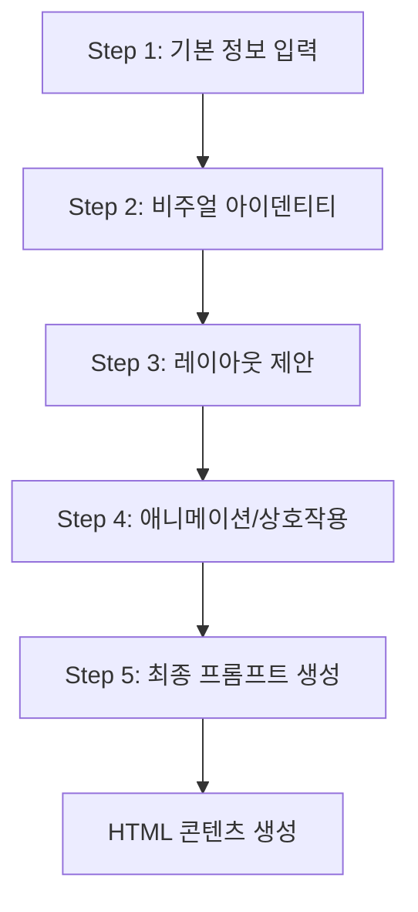

# 5단계 워크플로우 상세 명세

## 📋 워크플로우 개요



## Step 1: 기본 정보 입력

### 목적
프로젝트의 기본 정보를 수집하고 전체 워크플로우의 기초 데이터를 구성

### 입력 필드
- **프로젝트 제목** (필수): 교육 콘텐츠의 제목
- **대상 학습자** (필수): 연령대, 수준 등 대상 정의
- **페이지 구성** (필수): 페이지 수와 각 페이지 주제
- **레이아웃 모드** (필수):
  - `fixed`: 고정형 레이아웃 (슬라이드 형식)
  - `scrollable`: 스크롤형 레이아웃 (웹페이지 형식)
- **콘텐츠 모드** (필수):
  - `enhanced`: AI가 콘텐츠를 보강하여 생성
  - `restricted`: 입력된 내용만으로 생성
- **추가 제안사항** (선택): 특별 요구사항

### 출력 데이터
```typescript
interface ProjectData {
  id: string;
  projectTitle: string;
  targetAudience: string;
  pages: PageInfo[];
  suggestions?: string;
  layoutMode: 'fixed' | 'scrollable';
  contentMode: 'enhanced' | 'restricted';
}
```

## Step 2: 비주얼 아이덴티티 생성

### 목적
프로젝트에 맞는 일관된 시각적 스타일 생성

### AI 프롬프트
```
당신은 교육 콘텐츠 디자인 전문가입니다. 
프로젝트: {projectTitle}
대상: {targetAudience}
톤: {전문적/친근함/재미있음}

다음 요소들을 포함한 비주얼 아이덴티티를 생성해주세요:
- 색상 팔레트 (주색상, 보조색상, 강조색상)
- 타이포그래피 (제목, 본문 폰트)
- 전체적인 무드와 톤
- 컴포넌트 스타일 가이드
```

### 출력 데이터
```typescript
interface VisualIdentity {
  primaryColor: string;
  secondaryColor: string;
  accentColor: string;
  fontFamily: string;
  fontSize: string;
  tone: 'professional' | 'friendly' | 'playful';
  moodBoard: string;
  colorPalette: {
    primary: string;
    secondary: string;
    accent: string;
    text: string;
    background: string;
  };
  typography: {
    headingFont: string;
    bodyFont: string;
    baseSize: string;
  };
  moodAndTone: string;
  componentStyle: string;
}
```

### 사용자 상호작용
- AI 생성 결과 미리보기
- 색상 및 폰트 수정 가능
- 재생성 옵션 제공

## Step 3: 레이아웃 제안

### 목적
각 페이지의 레이아웃 구조와 콘텐츠 배치 계획 수립

### AI 프롬프트 (페이지별)
```
교육 콘텐츠 레이아웃 디자이너로서 다음 페이지의 레이아웃을 생성하세요.

페이지 정보:
- 페이지 번호: {pageNumber}
- 주제: {pageTopic}
- 콘텐츠 모드: {contentMode}

비주얼 아이덴티티:
- 색상: {colors}
- 폰트: {fonts}
- 톤: {tone}

다음을 포함하여 생성:
1. 그리드 구조
2. 주요 콘텐츠 배치
3. 이미지 위치 및 설명
4. 콘텐츠 블록 구성
```

### 출력 데이터
```typescript
interface LayoutProposal {
  pageId: string;
  pageTitle: string;
  layout: {
    structure: string;      // "2열 그리드, 상단 헤더"
    mainContent: string;    // "중앙 콘텐츠 영역에 텍스트"
    visualElements: string; // "우측에 일러스트레이션"
  };
  images: Array<{
    filename: string;       // "page1_hero.png"
    description: string;    // "학습 목표를 나타내는 일러스트"
    position?: string;      // "상단 중앙"
  }>;
  contentBlocks: Array<{
    type: 'heading' | 'body' | 'point' | 'activity';
    content: string;
    order: number;
  }>;
}
```

### 병렬 처리
- 모든 페이지를 동시에 처리
- 처리 시간 60% 단축

## Step 4: 애니메이션/상호작용 개선

### 목적
학습 효과를 높이는 동적 요소와 상호작용 설계

### AI 프롬프트 (페이지별)
```
UI/UX 전문가로서 교육 효과를 높일 수 있는 개선사항을 제안하세요.

페이지: {pageTopic}
대상: {targetAudience}
현재 레이아웃: {layoutDescription}

다음 요소들을 제안:
1. 애니메이션 효과
2. 상호작용 요소
3. 게이미피케이션
4. 마이크로 인터랙션
5. 페이지 전환 효과
```

### 출력 데이터
```typescript
interface PageEnhancement {
  pageId: string;
  animations: Array<{
    element: string;        // "제목 텍스트"
    type: string;          // "페이드인"
    trigger: string;       // "페이지 로드 시"
    duration: string;      // "0.5초"
  }>;
  interactions: Array<{
    element: string;       // "퀴즈 버튼"
    action: string;        // "클릭"
    response: string;      // "정답 표시"
  }>;
  gamification: {
    type: string;          // "포인트 시스템"
    description: string;   // "정답 시 10점 획득"
    rewards: string;       // "배지 획득"
  };
  microAnimations: Array<{
    trigger: string;       // "호버"
    effect: string;        // "스케일 업"
  }>;
  transitions: {
    pageEntry: string;     // "슬라이드 인"
    pageExit: string;      // "페이드 아웃"
    elementTransitions: string; // "스태거 애니메이션"
  };
}
```

## Step 5: 최종 프롬프트 생성

### 목적
모든 단계의 정보를 종합하여 HTML 생성용 최종 프롬프트 작성

### 프롬프트 구조

#### HTML 생성 프롬프트
```markdown
# 최종 교안 개발 프롬프트

## 1. 프로젝트 개요
- **프로젝트명**: {projectTitle}
- **대상 학습자**: {targetAudience}
- **총 페이지 수**: {totalPages}
- **레이아웃 모드**: {layoutMode}
- **콘텐츠 모드**: {contentMode}

## 2. 디자인 시스템
### 색상 팔레트
:root {
  --primary: {primaryColor};
  --secondary: {secondaryColor};
  --accent: {accentColor};
  --text: {textColor};
  --background: {backgroundColor};
}

### 타이포그래피
- 제목: {headingFont}
- 본문: {bodyFont}
- 기본 크기: {baseSize}

### 무드 & 톤
{moodAndTone}

## 3. 기술 요구사항
- 반응형 디자인
- 크로스 브라우저 호환성
- 접근성 준수 (WCAG 2.1)
- 성능 최적화

## 4. 페이지별 구현 가이드
{각 페이지의 상세 구현 사항}

### 페이지 1: {page1Title}
- 레이아웃: {page1Layout}
- 콘텐츠: {page1Content}
- 애니메이션: {page1Animations}
- 상호작용: {page1Interactions}

[이하 모든 페이지 반복]
```

#### 이미지 생성 프롬프트
```markdown
# AI 이미지 생성 프롬프트

## 프로젝트 정보
- 제목: {projectTitle}
- 스타일: {visualStyle}
- 색상: {colorScheme}

## 이미지 생성 목록

### 페이지 1 - {imageName1}
DALL-E 3 프롬프트:
"{detailedImagePrompt1}"

### 페이지 2 - {imageName2}
DALL-E 3 프롬프트:
"{detailedImagePrompt2}"

[모든 이미지 반복]
```

### 출력 데이터
```typescript
interface FinalPrompt {
  htmlPrompt: string;
  imagePrompts: Array<{
    pageId: string;
    imageName: string;
    prompt: string;
  }>;
  metadata: {
    generatedAt: Date;
    totalTokens: number;
    version: string;
  };
}
```

## 🔄 단계 간 데이터 흐름

```
Step 1 (ProjectData)
    ↓
Step 2 (VisualIdentity) ← ProjectData
    ↓
Step 3 (LayoutProposals) ← ProjectData + VisualIdentity
    ↓
Step 4 (PageEnhancements) ← ProjectData + VisualIdentity + LayoutProposals
    ↓
Step 5 (FinalPrompt) ← 모든 이전 단계 데이터
```

## 📊 성능 지표

- **Step 1**: 즉시 완료 (사용자 입력)
- **Step 2**: ~5초 (단일 AI 호출)
- **Step 3**: ~10초 (병렬 처리, 페이지당 ~2초)
- **Step 4**: ~10초 (병렬 처리, 페이지당 ~2초)
- **Step 5**: 즉시 완료 (템플릿 생성)

**총 예상 시간**: 25-30초

## 🎯 품질 보증

### 각 단계별 검증
- **Step 1**: 필수 필드 검증, 페이지 수 제한 (1-20)
- **Step 2**: 색상 유효성, 폰트 가용성 확인
- **Step 3**: 레이아웃 일관성, 콘텐츠 완성도
- **Step 4**: 애니메이션 실행 가능성, 성능 영향
- **Step 5**: 프롬프트 토큰 수, 구조 완성도

### 오류 처리
- 각 단계별 폴백 메커니즘
- 부분 실패 시 기본값 사용
- 사용자에게 명확한 오류 메시지 제공

---

*이 문서는 워크플로우 구현 진행에 따라 업데이트됩니다.*