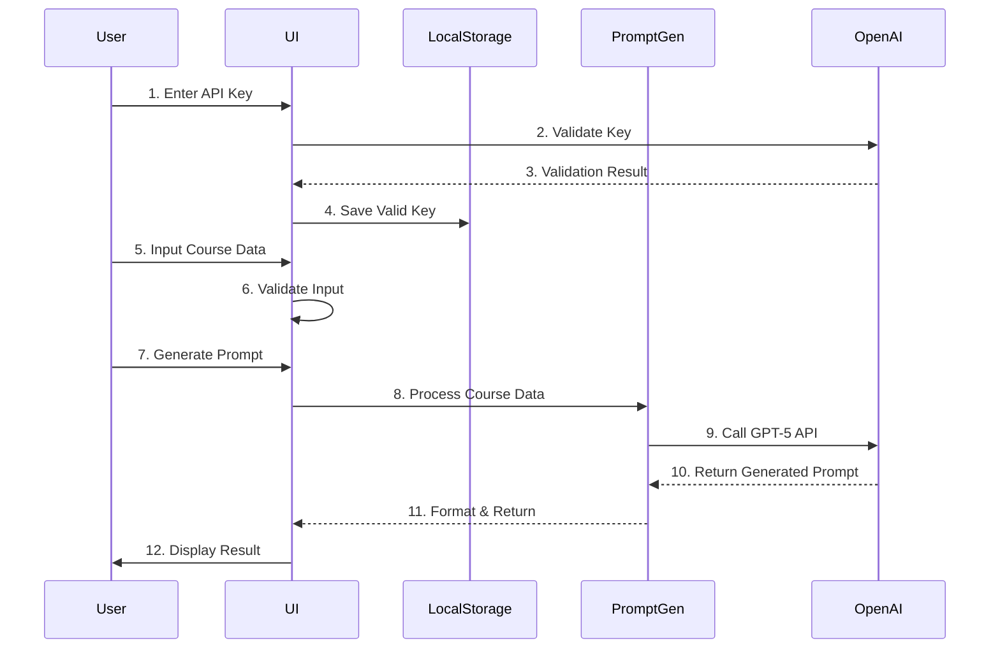

# 교안 프롬프트 생성기 MVP - System Design

## 1. System Overview

### Purpose
사용자가 입력한 교안 정보(주제, 학습대상, 페이지별 내용)를 바탕으로 Claude Code에서 교안을 개발할 수 있는 상세한 프롬프트를 자동 생성하는 웹 애플리케이션

### Core Features
- OpenAI API 키 관리 (로컬스토리지 저장)
- 교안 정보 입력 인터페이스
- GPT-5를 활용한 프롬프트 자동 생성
- 생성된 프롬프트 표시 및 복사 기능

## 2. System Architecture

```
┌─────────────────────────────────────────────────────────────┐
│                        Frontend (React)                       │
├───────────────────────────────────────────────────────────────┤
│                                                               │
│  ┌──────────────┐  ┌──────────────┐  ┌──────────────┐       │
│  │   API Key    │  │  Course Form │  │   Result     │       │
│  │   Manager    │  │   Component  │  │   Display    │       │
│  └──────┬───────┘  └──────┬───────┘  └──────┬───────┘       │
│         │                  │                  │               │
│  ┌──────▼──────────────────▼──────────────────▼──────┐       │
│  │              Application State Manager             │       │
│  └────────────────────────┬───────────────────────────┘       │
│                           │                                   │
│  ┌────────────────────────▼───────────────────────────┐       │
│  │              OpenAI Service Layer                  │       │
│  └────────────────────────┬───────────────────────────┘       │
└───────────────────────────┼───────────────────────────────────┘
                            │
                            ▼
                    ┌───────────────┐
                    │  OpenAI API   │
                    │   (GPT-5)     │
                    └───────────────┘
```

## 3. Component Specifications

### 3.1 API Key Manager
**Purpose**: OpenAI API 키 관리 및 유효성 검증

**Interface**:
```typescript
interface ApiKeyManagerProps {
  onKeyValidated: (key: string) => void;
}

interface ApiKeyManagerState {
  apiKey: string | null;
  isValidated: boolean;
  isValidating: boolean;
  error: string | null;
}
```

**Functions**:
- `validateApiKey(key: string): Promise<boolean>` - API 키 유효성 검증
- `saveApiKey(key: string): void` - 로컬스토리지에 키 저장
- `loadApiKey(): string | null` - 저장된 키 로드
- `clearApiKey(): void` - 키 삭제

### 3.2 Course Form Component
**Purpose**: 교안 정보 입력 폼

**Interface**:
```typescript
interface CourseFormData {
  subject: string;          // 교안 주제
  targetAudience: string;   // 학습 대상
  pages: PageContent[];     // 페이지별 내용
}

interface PageContent {
  pageNumber: number;
  title: string;
  content: string;
  objectives?: string[];    // 학습 목표
  activities?: string[];    // 활동 내용
}

interface CourseFormProps {
  onSubmit: (data: CourseFormData) => Promise<void>;
  isLoading: boolean;
}
```

**Features**:
- 동적 페이지 추가/삭제
- 입력 검증
- 자동 저장 (localStorage draft)

### 3.3 Prompt Generator Service
**Purpose**: GPT-5를 사용한 프롬프트 생성

**Interface**:
```typescript
interface PromptGeneratorService {
  generatePrompt(
    courseData: CourseFormData,
    apiKey: string
  ): Promise<GeneratedPrompt>;
}

interface GeneratedPrompt {
  prompt: string;
  metadata: {
    generatedAt: Date;
    estimatedTokens: number;
    subject: string;
  };
}
```

**Implementation Details**:
```typescript
class PromptGenerator {
  private openai: OpenAI;
  
  constructor(apiKey: string) {
    this.openai = new OpenAI({ 
      apiKey,
      dangerouslyAllowBrowser: true 
    });
  }
  
  async generatePrompt(courseData: CourseFormData): Promise<GeneratedPrompt> {
    const systemPrompt = this.buildSystemPrompt();
    const userPrompt = this.formatCourseData(courseData);
    
    const response = await this.openai.responses.create({
      model: "gpt-5",
      instructions: systemPrompt,
      input: userPrompt,
      reasoning: { effort: "medium" }
    });
    
    return {
      prompt: response.output_text,
      metadata: {
        generatedAt: new Date(),
        estimatedTokens: this.estimateTokens(response.output_text),
        subject: courseData.subject
      }
    };
  }
}
```

### 3.4 Result Display Component
**Purpose**: 생성된 프롬프트 표시 및 관리

**Interface**:
```typescript
interface ResultDisplayProps {
  prompt: GeneratedPrompt | null;
  onCopy: () => void;
  onDownload: () => void;
  onEdit: () => void;
}
```

**Features**:
- 구문 강조 표시
- 원클릭 복사
- 텍스트 파일 다운로드
- 프롬프트 편집 기능

## 4. Data Flow



## 5. API Integration Pattern

### GPT-5 Request Structure
```javascript
const generateClaudePrompt = async (courseData) => {
  const response = await openai.responses.create({
    model: "gpt-5",
    reasoning: { effort: "medium" },
    instructions: `
      당신은 교육 자료 개발 전문가입니다.
      주어진 교안 정보를 바탕으로 Claude Code가 
      교안을 개발할 수 있는 상세한 프롬프트를 작성하세요.
      
      프롬프트는 다음을 포함해야 합니다:
      1. 명확한 목표 설정
      2. 구체적인 콘텐츠 요구사항
      3. 형식 및 스타일 가이드
      4. 평가 기준
    `,
    input: JSON.stringify({
      subject: courseData.subject,
      audience: courseData.targetAudience,
      pages: courseData.pages.map(page => ({
        number: page.pageNumber,
        title: page.title,
        content: page.content,
        objectives: page.objectives,
        activities: page.activities
      }))
    })
  });
  
  return response.output_text;
};
```

## 6. State Management

### Application State Structure
```typescript
interface AppState {
  auth: {
    apiKey: string | null;
    isAuthenticated: boolean;
  };
  course: {
    data: CourseFormData | null;
    draft: Partial<CourseFormData> | null;
    lastSaved: Date | null;
  };
  generation: {
    isGenerating: boolean;
    currentPrompt: GeneratedPrompt | null;
    history: GeneratedPrompt[];
    error: string | null;
  };
  ui: {
    activeStep: 'api-key' | 'course-input' | 'result';
    theme: 'light' | 'dark';
  };
}
```

## 7. Error Handling

### Error Types
```typescript
enum ErrorType {
  API_KEY_INVALID = 'API_KEY_INVALID',
  API_RATE_LIMIT = 'API_RATE_LIMIT',
  NETWORK_ERROR = 'NETWORK_ERROR',
  VALIDATION_ERROR = 'VALIDATION_ERROR',
  GENERATION_ERROR = 'GENERATION_ERROR'
}

interface AppError {
  type: ErrorType;
  message: string;
  details?: any;
  timestamp: Date;
}
```

### Error Recovery Strategies
- **API Key Invalid**: 키 재입력 프롬프트
- **Rate Limit**: 재시도 with exponential backoff
- **Network Error**: 오프라인 모드 & 자동 재시도
- **Validation Error**: 인라인 에러 메시지
- **Generation Error**: 대체 프롬프트 템플릿 사용

## 8. Security Considerations

- API 키는 로컬스토리지에 암호화하여 저장
- 브라우저에서 직접 API 호출 (dangerouslyAllowBrowser: true)
- CORS 정책 준수
- XSS 방지를 위한 입력 sanitization
- Rate limiting 구현

## 9. Performance Optimizations

- 입력 디바운싱 (500ms)
- 자동 저장 스로틀링 (2초)
- 결과 캐싱 (동일 입력)
- 코드 스플리팅 (lazy loading)
- 프롬프트 히스토리 제한 (최대 10개)

## 10. Future Enhancements

### Phase 2
- 프롬프트 템플릿 라이브러리
- 다중 언어 지원
- 협업 기능 (공유 링크)
- 프롬프트 버전 관리

### Phase 3
- Backend API 서버 구축
- 사용자 계정 시스템
- 프롬프트 평가 및 피드백
- AI 모델 선택 옵션 (GPT-4, Claude 등)

## 11. Tech Stack Summary

### Frontend
- **Framework**: React 18.x with TypeScript
- **State Management**: Context API + useReducer
- **Styling**: Tailwind CSS
- **Build Tool**: Vite
- **API Client**: OpenAI SDK

### Development Tools
- **Linting**: ESLint
- **Formatting**: Prettier
- **Testing**: Jest + React Testing Library
- **Type Checking**: TypeScript strict mode

### Deployment
- **Hosting**: Vercel / Netlify
- **CI/CD**: GitHub Actions
- **Monitoring**: Sentry (error tracking)